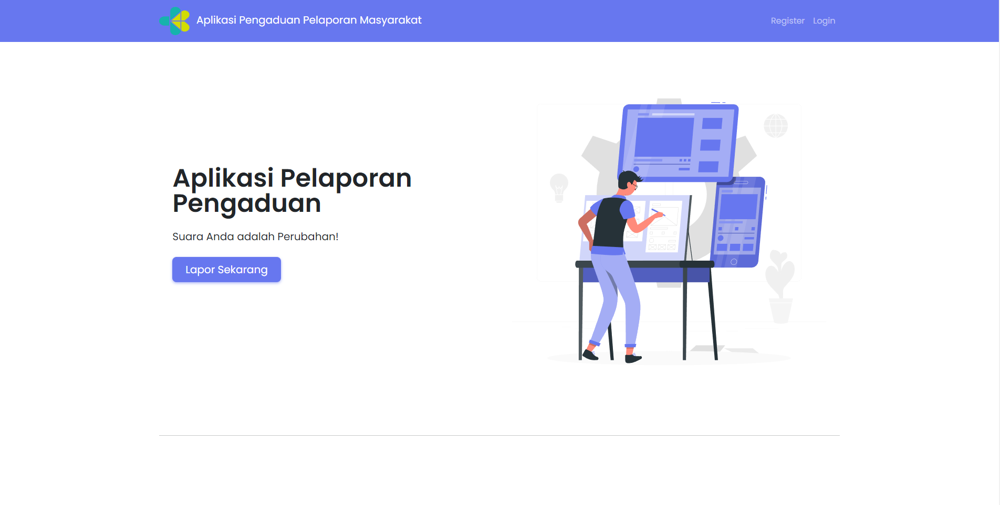
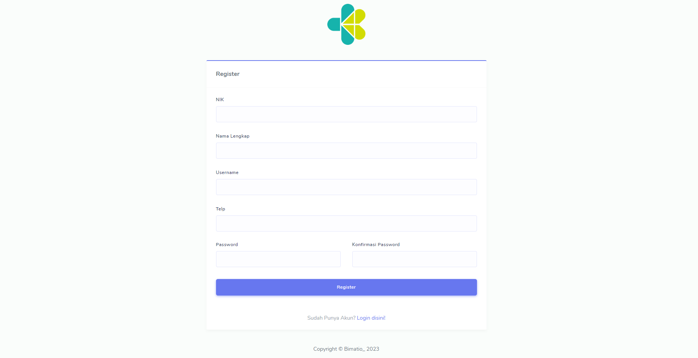
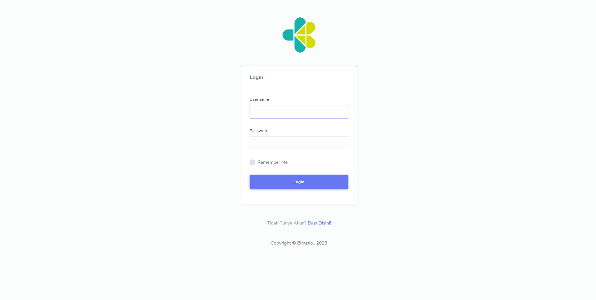
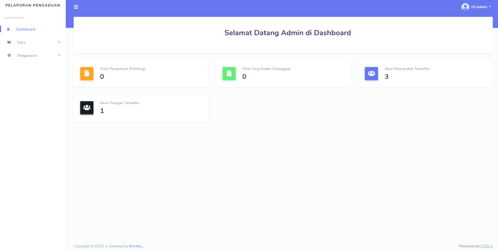
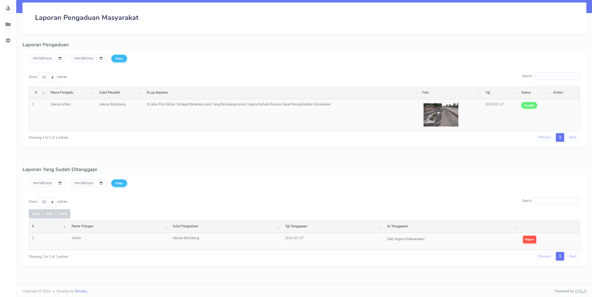
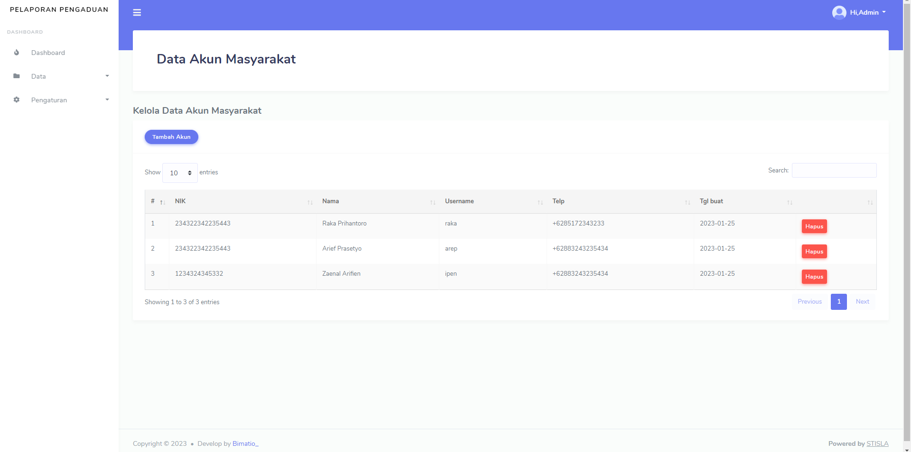
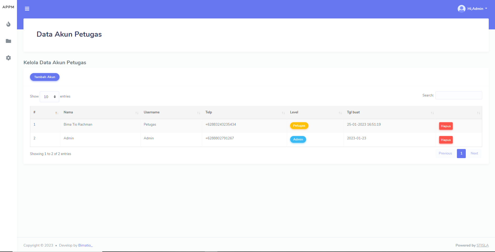
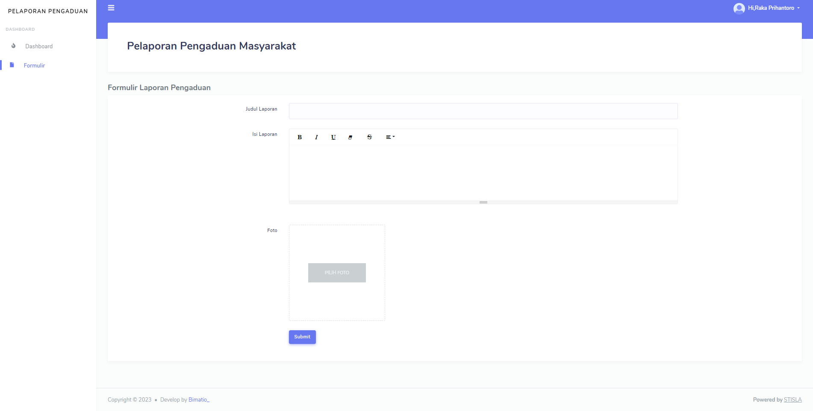

# Aplikasi Pelaporan Pengaduan Masyarakat

  ### Created By
  > Nama : Bima tio rachman

  > Kelas : XII RPL

  > Nomor : 10

## UJIKOM RPL TH 2023

APPM atau Aplikasi Pelaporan Pengaduan Masyarakat adalah Aplikasi berbasis Website untuk membantu Pengaduan masyarakat jika terjadi sesuatu disekitar.

### Tech Stack , UI Framework & Admin Template

> PHP v8.2.1

> MySQL

> JavaScript

> Bootstrap 4

> Stisla Admin Template

#### Plugin JS

- jQuery
- DataTables
- SummerNote
- SweetAlert
- AOS
- dll

## Fitur

- Login 3 Level (Tamu,Petugas,Admin)
- Tamu hanya dapat login,mengajukan pengaduan
- Petugas Hanya dapat Verifikasi & Validasi Laporan Pengaduan
- Admin dapat Verifikasi & Validasi,Export laporan,Tambah Akun Petugas

## Info Project

> Project ini masih dalam tahap pembuatan

> Start Project : 20/01/2023

> End Project : 27/01/2023

# Dokumentasi Sederhana
> Landing Page

>Register Page

> Login Page 

> Dashboard Admin 

> Data Laporan

> Data Akun Masyarakat

> Data Akun Petugas

> Form Pengaduan 

